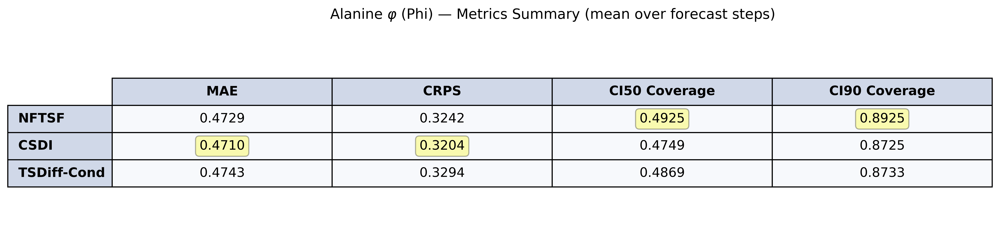
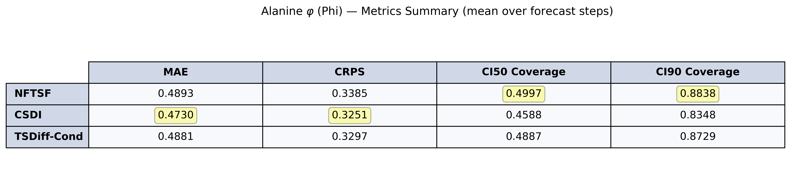
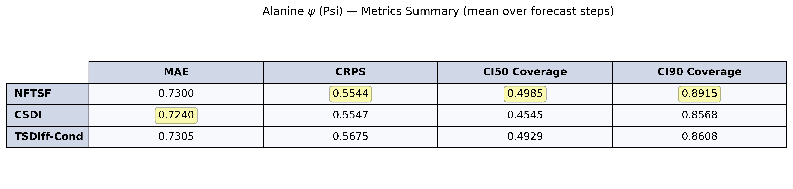

# Alanine Phi

### Alanine Phi 25/25

### Alanine Phi 50/25

### Alanine Phi 50/50

### Alanine Phi 100/50

### Alanine Phi 100/100

# Alanine Psi

### Alanine Psi 25/25

### Alanine Psi 50/25

### Alanine Psi 50/50

### Alanine Psi 100/50

### Alanine Psi 100/100

